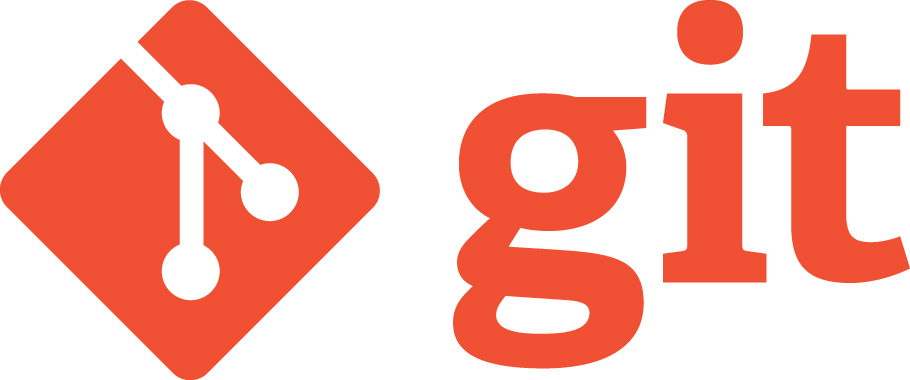

#An Introduction to Git and GitHub

This is a introductory lesson to GIT and GitHub. The notes can be found below. There is an practical to accompany the notes [which can be found here](https://github.com/joeappleton18/solentgit/blob/master/practical.md)  


#Contents

- [Learning outcomes](#learning-outcomes)
- [What is version control](#what-is-version-control)
- [The git version control system](#the-git-version-control-system)
	- [How to install GIT](#how-to-install-Git)
	- [Using Git on the command line](#using-git-on-the-command-line)
	- [Initial configuration](#initial-configuration)
   - [Creating a new Git repository](#creating-a-new-git-repository)
   - [Rolling Back Your Work](#rolling-back-your-work)
   - [Git Remote Repositories](#git-remote-repositories)

#Learning outcomes

By the end of this session you will:


- Understand what version control is and why it's important 
- Know the basics of the GIT version control system
   - Be able able to configure GIT 
	- Be able to set up a GIT repository 
	- Be able to make commits 
	- Be able to roll back your work if there is an error 
	
- Be able to remotely host your work on GITHub

#What is version control 

- A Version control system is simply a tool that helps individuals and teams manage changes in their projects over time. 

- Traditionally version control was used to manage programming source code. However non programmers such as designers have increasingly been using version control as part of their workflow. 


- It's tempting to think - "Why don't I just use cloud storage such as DropBox".  While using cloud storage is better than nothing, using version control has the following advantages:

	- **History:** you get a complete history of changes in your project 
	- **Peace of mind:** you can develop new features in isolation 
	- **Disaster recovery:** you can roll back your work to a working version at any time

##Further resources 

[A video introducing version control](https://git-scm.com/video/what-is-version-control)

[Pro Git introduction to version control](https://git-scm.com/book/en/v2/Getting-Started-About-Version-Control)


#The Git version control system



GIT as of 2016 is one of the most popular version control systems

- With regards to web development GIT has become the industry standard


>> [Rhode Code version control poll](https://rhodecode.com/insights/version-control-systems-2016)

#How to install Git 


GIT is easy to install on a desktop computer.

- [Simply download and run the executable](https://git-scm.com/download/win)

##Further resources 

- [GIT Home page](https://git-scm.com/)
- [GIT download link](https://git-scm.com/download/win)


#Using Git on the command line

- You can either use command line or a GUI tool to manage GIT
- We'll focus on command line for this tutorial 
- Most people tend to focus on command line/terminal over the GUI application


>> If you're using windows for the sake of this tutorial open GIT bash (it comes with your git installation). If you're using a MAC open terminal. 


##Further resources 
- [GIT reset information](https://git-scm.com/docs/git-reset)


##Initial configuration 

You need to tell GIT who you are, this information is then automatically included in you commits. Run the following commands in your terminal:


```bash
git config --global user.name "John Doe"  
git config --global user.email johndoe@example.com  
```
>> **TIP:** to run a command in terminal type in the instructions and after each line press enter

**Optional Text Editor**

We can also tell git to use a  specific text editor, run the command below which instructs GIT to use Notepad++:

```bash
git config --global core.editor "'C:/Program Files (x86)/Notepad++/notepad++.exe' -multiInst -nosession"
```

##Further resources 

- [Essential terminal commands](http://www.hongkiat.com/blog/web-designers-essential-command-lines/)


##Creating a new Git repository 

- When you start a new project you run the command `git init` within your projects root folder. This creates an empty git repository. 

-  A repository is a kind of database where your project is stored. Changes made to your project are stored in this database.


>> Git will now be tracking all changes within your project folder

##Further resources 

[A introduction to GIT repositories](https://www.sbf5.com/~cduan/technical/git/git-1.shtml)

#Making commits 

- When we've got to a stage in a project where we want to in essentially, make a back up. We:
 	- Stage the files we want to commit,  
 		- `git add -A` stages all the files for commit 
 		- `git add sample.txt` stages just sample.txt for commit
 	- We now can take a snapshot of our project by running `git commit -m "set up home page"` notice how we add a message to the commit, this should be a short description of the work you have completed for this commit. 

 	


	
#Rolling Back Your Work

- There are many different ways to roll back work when you're using git 
- We're going to focus on just one, resetting the head

####`git reset --hard`

- `git reset --hard` will reset all the file in the working directory back to how they were in the last commit 

- If you commit regularly, this technique may be all you need 


#Git Remote Repositories 

- One of the true powers of working with GIT 
- They allow us to store our work in any location that is running a GIT server
- You'll never lose your work 
- [www.github.com](www.github.com), the most popular remote host

###Using GitHub as a remote host 


>> <sub> Getting the remote address of a repository </sub>

###Git Clone

- If you wan't a carbon copy of a repository by running, `git clone <address>
` 
- If you run `git clone https://github.com/joeappleton18/swd500.git` you'll get a full carbon copy of the entire repository containing the course material on your local computer 


###Two way communication 

- Git Clone is fine if we just want to pull a project directly off GITHUb and store it locally. 
-  Most of the time you'll want to send changes back to GITHub for safe keeping
	
**Git makes this easy:**

- Get the remote address of your repository, as shown in the diagram above
- Locally create a empty folder to hold your project 
-  Then locate this folder from your shell application and run the following commands

```bash 
git init 
git remote add origin <remote address>
```

As you can see `git remote` takes two arguments  
	- The remote name, `origin` in this case. This is so we can easily reference the remote without having to remember the full address 
	- Running `git remote -v`, will display your remote address

	

We can now `push` and `pull` to the remote host

- `git pull origin master`  //pulls files from the origin 
- `git push origin master` // sends files to origin  

The typical workflow would be:

- **Pull** from the origin, work locally and make regular commits
- When you end your work session, **push** the changes to the origin for safe keeping 
	
	


