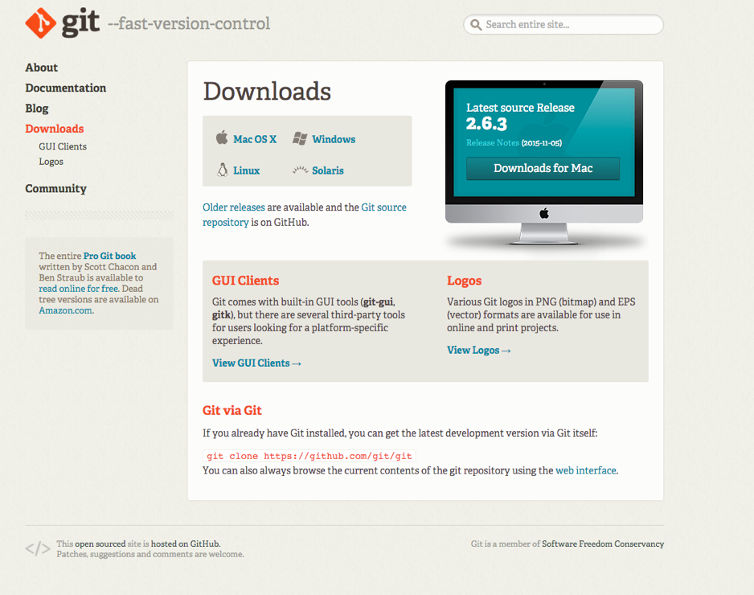
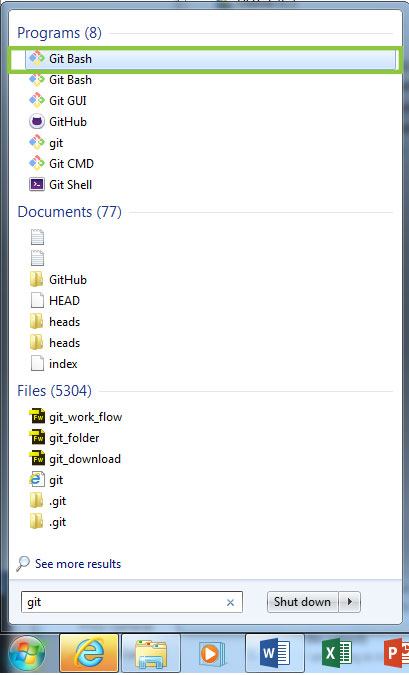
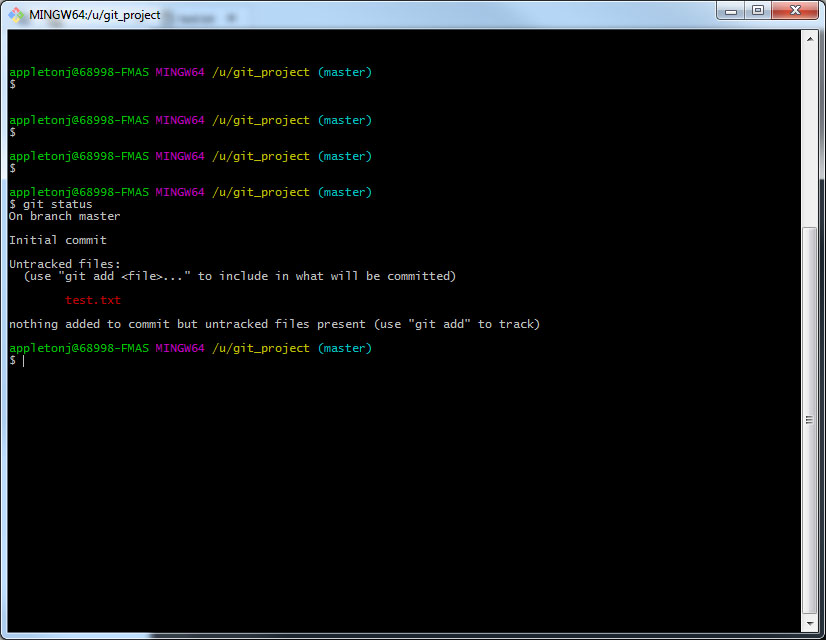
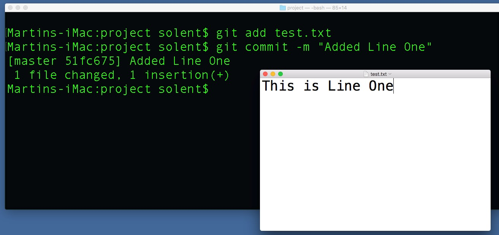
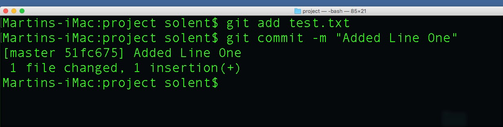
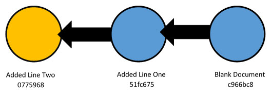

#1 - Set up a new project folder

Set up a new folder on your `u` drive called `git_project`. Leave it empty for now, later on this will hold our project


#2 - Download GIT 

[https://git-scm.com/downloads](https://git-scm.com/downloads)
 


#3 - Using GIT

### Using the shell 

As previously discussed, we're going to be using the shell in order to interact with GIT. If you've never used a shell before it can be a little daunting at first, but after a little bit of practice. In the next session we'll introduce the GUI application, but we'd like everyone to get a basic overview of how the command line works.


**Open gitBash**




>> This will load up the git console 

### Your Identity
You need to tell GIT who you are, this information is then automatically included in you commits. Run the following commands in your shell:


```bash
git config --global user.name "John Doe"  
git config --global user.email johndoe@example.com  
```

### Your Editor

We need to tell git to use a text editor, run the command below which instructs GIT to use Notepad++:  


```bash
git config --global core.editor "'C:/Program Files (x86)/Notepad++/notepad++.exe' -multiInst -nosession"
```


#4 Initiate an empty GIT Repo

- Navigate to your project root folder, you can do this by typing the following command into the shell: 
 
	`cd u:\git_project`


- Ensure that you are in your project root directory, by running the command below (this will print the current directory that you're in). 
	
	`pwd`
    

- Next, run the command:

	`git init`

- If everything runs well, you should be prompted that an empty GIT repo has been created:

	 `Initialized empty Git repository in c:/your/folder/location`

- Run `git status` this tells you the current state of the repository. You should see the following output:

```bash
On branch master  
Initial commit 
nothing to commit (create/copy files and use "git add" to track) 
``` 
	 
	
#5 Make and commit some changes

- Within your project folder create a new file called `test.txt`, you can do this using a text editor

- Run `git status`, you should be prompted that there is an untracked file:
	
   

- Run the command `git add test.txt`, git now the adds file to the Staging area

- Run `git status` again, you should now see that test.txt is in the staging area and is ready to be committed

- To make your first commit run `git commit -m "Blank document" git will now track all future changes to test.txt

- Run `git log` gives log of everything updated in the repository 	

**You now have a snap shot of your work**


>> TIP If your shell/terminal window becomes choked out you can type: `clear` and press enter
 


#6 Making further commits 









#7 Self Study


Next session we'll be looking at remotes and how to remotely store your work on GitHub. If you have time, try and work our how to push your work to a new repository that you've create on GITHub.
